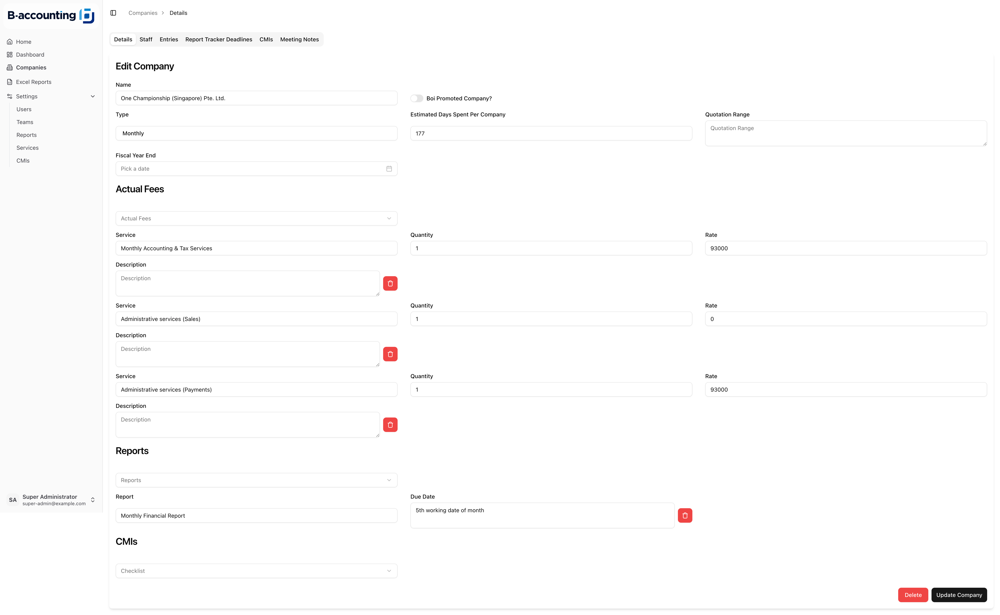
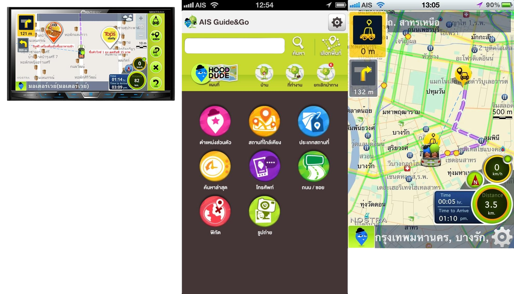

## Portfolio Summary

This portfolio highlights around 40% of my professional work in software development and project management. It includes projects from various companies, some of which have since closed. Each project showcases my commitment to delivering innovative solutions and enhancing user experiences across web and mobile applications using technologies like React, Next.js, Flutter, and Swift. I invite you to explore my work and see how I adapt and thrive in dynamic environments.
<a href="./nuttapol-thitaweera-portfolio.pdf" target="_blank">Download PDF</a>
## Projects

**B-Accounting Internal system** Mar 2025 - Present   
**Technologies:** [Next.js 15.3.2](https://github.com/vercel/next.js/), [shadcn](https://ui.shadcn.com/), [next-auth](https://github.com/nextauthjs/next-auth), [prisma](https://github.com/prisma/prisma), [CASL](https://github.com/stalniy/casl), [tailwindcss](https://github.com/tailwindlabs/tailwindcss)

**Description:** An internal system designed to manage company resources, track staff resource, and monitor client service, report, meeting.

**Responsibilities:**
- Designed intuitive database schemas and CMS interfaces for seamless user interaction  
- Developed full-stack CMS features to support robust backend logic and usability

**Achievements:**  

**Link:** [https://b-accounting.smartsoftasia.com/sign-in](https://b-accounting.smartsoftasia.com/sign-in)  

**Comp-moto POS** Aug 2024 - Mar 2025   
**Technologies:** [Next.js v15.0.2](https://github.com/vercel/next.js/), [nextui](https://github.com/nextui-org/nextui), [next-auth](https://github.com/nextauthjs/next-auth), [prisma](https://github.com/prisma/prisma), [CASL](https://github.com/stalniy/casl), [tailwindcss](https://github.com/tailwindlabs/tailwindcss)

**Description:** A custom POS solution built for Comp-moto to streamline sales operations, inventory, and admin workflows.

**Responsibilities:**
- Designed database structures and CMS frontends  
- Set up scalable project environments 
- Developed complete CMS features with integrated backend logic  
- Delegated tasks efficiently to ensure smooth and timely delivery 

**Achievements:**  
- Designed a fully customized POS system tailored to Comp-moto’s business workflows and operational structure  
- Enabled stock synchronization between the custom POS system and Microsoft Dynamics 365  
- Improved staff productivity and accuracy by streamlining UI/UX across POS terminals and CMS dashboards

**Link:** [https://comp-moto.smartsoftasia.com/admin/sign-in](https://comp-moto.smartsoftasia.com/admin/sign-in)  

_________________

**Foamtec International Internal System** Nov 2023 - Jul 2024   
**Technologies:** [Next.js v14.1.4](https://github.com/vercel/next.js/), 
[nextui](https://github.com/nextui-org/nextui), [next-auth](https://github.com/nextauthjs/next-auth), [prisma](https://github.com/prisma/prisma), [CASL](https://github.com/stalniy/casl), [tailwindcss](https://github.com/tailwindlabs/tailwindcss)

**Description:** An internal manufacturing control system for Foamtec International, built to streamline production workflows, manage tooling and materials, and monitor QC operations. The system supports both tablet and back-office users with role-based access to production dashboards, scheduling, and planning tools.

**Responsibilities:**
- Developed efficient database designs and intuitive CMS frontends.
- Delegated tasks to team members, ensuring smooth and timely project execution.
- Set up project environments that included essential tools and frameworks for a productive workflow.
- Implemented CMS frontends and backend logic for critical areas such as Material Management, Work Centers, BOMs, Tooling, Routing, Material Planning, Production Orders and QC.
- Created a RESTful API for the Flutter application, enhancing system interoperability.

**Link:** [https://foamtec.smartsoftasia.com/](https://foamtec.smartsoftasia.com/)  

_________________

**DASTA-SMARTCBT** Aug 2023 - Oct 2024   
**Technologies:** [Next.js v13.5.6](https://github.com/vercel/next.js/),  [tailwindcss](https://github.com/tailwindlabs/tailwindcss), [headlessui](https://github.com/tailwindlabs/headlessui)  

**Description:**  A digital platform built for DASTA (Designated Areas for Sustainable Tourism Administration), a Thai government agency under the Office of the Prime Minister. The system streamlines community-based tourism (CBT) operations through tools that support project management, carbon footprint tracking, and social/environmental impact assessments like SIA and SROI.

**Responsibilities:**
- Created detailed quotations and project estimations to scope development accurately  
- Delegated tasks and oversaw progress to ensure timely delivery  
- Collaborated with project managers to facilitate effective sprint planning  
- Set up and maintained the development environment for the engineering team  
- Developed modern, responsive web frontends for key modules including Project Creation, Carbon Footprint, and SIA/SROI evaluations  

**Link:** [Youtube](https://www.youtube.com/watch?v=fnVUfYz_QEc), [https://smartcbt.dasta.or.th/login](https://smartcbt.dasta.or.th/login)  

_________________

**El mercado** June 2023 - July 2023   
**Technologies:** [Next.js v13.5.6](https://github.com/vercel/next.js/), [prisma](https://github.com/prisma/prisma), [next-auth](https://github.com/nextauthjs/next-auth), [CASL](https://github.com/stalniy/casl), [tailwindcss](https://github.com/tailwindlabs/tailwindcss), [headlessui](https://github.com/tailwindlabs/headlessui)  
**Responsibilities:**
- Prepared detailed quotations and comprehensive project estimates.
- Designed robust database structures tailored for application needs.
- Developed RESTful APIs for Flutter applications and web frontends, encompassing User Authentication, Branches, Products, Product Options, Promotions, and Shopping Carts.
- Delivered complete CMS features—from initial design through production deployment—fully aligned with business goals and client expectations  

**Description:** \
**Link:** [https://app.elmercadobangkok.com](https://app.elmercadobangkok.com/admin/sign-in)  

_________________

**Volvo Car Thailand Distribution Center (VCTPDS)** Nov 2022 - May 2024   
**Technologies:** [Next.js v13.1.6](https://github.com/vercel/next.js/), [prisma](https://github.com/prisma/prisma), [next-auth](https://github.com/nextauthjs/next-auth), [CASL](https://github.com/stalniy/casl), [tailwindcss](https://github.com/tailwindlabs/tailwindcss), [headlessui](https://github.com/tailwindlabs/headlessui)  

**Description:** VCT-DS serves as an internal Pre-Delivery Inspection (PDI) and Pre-Delivery Service Checklist for new cars, guaranteeing that all vehicles meet stringent quality standards before delivery, thus enhancing customer satisfaction and operational efficiency.

**Responsibilities:**
- Developed detailed quotations and accurate project estimates.
- Crafted database designs and a comprehensive CMS for user interactions.
- Delegated tasks effectively, ensuring timely project milestones.
- Organized and facilitated sprint planning sessions, optimizing workflow for enhanced productivity.
- Developed a RESTful API for the Flutter application and web frontend, ensuring seamless user experiences.
- Delivered CMS frontend features from inception through deployment, aligning with project goals and client expectations.

**Achievements:**  
- Successfully helped manage and inspect over 8,000 vehicles (and counting), significantly improving operational oversight and reducing delivery delays 
- Improved inspection workflow visibility and digital documentation accuracy through centralized CMS and reporting  
- Enabled seamless coordination across roles including PDI staff, managers, and logistics via custom role-based access control

**Link:** [https://vctpds.com/](https://vctpds.com/)  

_________________

**JUST CAR** Aug 2022 - Aug 2023   
**Technologies:** [Next.js v12.2.5](https://github.com/vercel/next.js/), [prisma](https://github.com/prisma/prisma), [next-auth](https://github.com/nextauthjs/next-auth), [CASL](https://github.com/stalniy/casl), [tailwindcss](https://github.com/tailwindlabs/tailwindcss), [headlessui](https://github.com/tailwindlabs/headlessui)  
**Responsibilities:**
- Developed comprehensive quotations and project estimates, ensuring accuracy and transparency throughout the process.
- Designed robust database architectures that support application functionality and ensure data integrity.
- Collaborated closely with the project manager to orchestrate and manage sprint planning sessions, enhancing both workflow efficiency and team collaboration.
- Oversaw the development process, maintaining quality and alignment with project objectives, while delegating tasks effectively to ensure timely delivery of milestones.
- Established project environments equipped with all necessary tools and frameworks for seamless development.
- Developed RESTful APIs for Flutter applications and web frontends, facilitating smooth user interactions.

**Description:** JUST CAR is a dynamic platform for buying and selling used cars, offering users the ability to sell any model or year of vehicle while providing access to a range of quality used cars at competitive prices. The platform also supports various models to meet diverse customer needs, with numerous registered buyers eager to engage in transactions. Additionally, its affiliate company, JUST LOAN, offers loan services to assist customers with financial solutions.\
**Link:** [https://justcar.co.th/](https://justcar.co.th/), [App Store](https://apps.apple.com/th/app/just/id1633206350),  [PlayStore](https://play.google.com/store/apps/details?id=com.justcar.justcar&hl=th&pli=1)  

_________________

**Villeroy & Boch** May 2022 - Aug 2022   
**Technologies:** [Next.js v12.1.5](https://github.com/vercel/next.js/), [prisma](https://github.com/prisma/prisma), [next-auth](https://github.com/nextauthjs/next-auth), [CASL](https://github.com/stalniy/casl), [tailwindcss](https://github.com/tailwindlabs/tailwindcss), [headlessui](https://github.com/tailwindlabs/headlessui)  

**Description:** The 1748 Club is designed for ease of use, rewarding users with points for various actions that can be redeemed for special offers.

**Responsibilities:**
- Developed user-friendly web frontends that enhance customer engagement and satisfaction.

**Link:** [https://1748club.asia/](https://1748club.asia/) 

**Achievements:**  
- Improved the existing website by optimizing performance and modernizing the tech stack for a better user experience

_________________

**evEatz APIs** Jun 2020 - Oct 2022   
**Technologies:** [go v1.16](https://github.com/golang/go), [go-redis](https://github.com/redis/go-redis), [gorm v1.21.12](https://github.com/go-gorm/gorm), [gin v1.7.2](https://github.com/gin-gonic/gin), [centrifuge](https://github.com/centrifugal/centrifuge), [firebase-admin-go](https://github.com/firebase/firebase-admin-go)
**Responsibilities:**
- Developed RESTful APIs that empower both Rider and Driver applications, ensuring seamless communication and data exchange between the client and server.
- Integrated the 2C2P payment system, enabling secure and efficient payment processing for users.

_________________

**evRiderz and evDriverz iOS Applications** Mar 2021 - Oct 2020   
**Technologies:**  [Swift v5.3](https://github.com/swiftlang/swift)\
**Responsibilities:**
- Developed feature-rich Rider and Driver applications that enhance the overall user experience.

_________________

**Description:** evRiderz is dedicated to providing green transportation solutions via electric vehicles. Their offerings include ridesharing, food delivery, and income opportunities for drivers. The platform incorporates electric motorcycles (e-bikes) and features such as battery swaps to minimize downtime, all while promoting eco-friendly transportation that benefits users and the environment.
**Link:** [evRiderz](https://evriderz.com/)   

_________________

**Perfumist** Aug 2019 - May 2021   
**Technologies:**  [Swift v5.4](https://github.com/swiftlang/swift)\
**Responsibilities:**
- Developed two innovative iOS applications that significantly enhance user functionality and experience through thoughtful design and technological integration.

**Link:** [App Store](https://apps.apple.com/us/app/perfumist-perfumes-advisor/id631338649) 

_________________

**SBITO** Nov 2020 - Jan 2021   
**Technologies:** [Swift v5.3.1](https://github.com/swiftlang/swift)

**Responsibilities:**
- Led the development of the account opening section of the SBITO iOS application (native).
- Streamlined the account creation process through a step-by-step guided approach.
- Key features include:
  - Identity verification for enhanced security.
  - Selection of account types: cash balance, credit balance, and mutual fund accounts.
  - Secure data submission.
  - Integration with major banks for swift validation.
- Simplified and expedited the account creation process, significantly improving the overall user experience.

**Link:** [App Store](https://apps.apple.com/th/app/sbito/id1533272611)

_________________

**Siam Piwat  Indoormap SDK for iOS, React-Native** Jun 2020 - Jan 2021   
**Technologies:** [Swift v5.3.2](https://github.com/swiftlang/swift), [mappedin](https://www.mappedin.com/)

**Responsibilities:**
- Developed an indoor map navigation SDK in Swift for iOS and React Native integration  
- Implemented place search functionality and real-time route simulation  
- Created a navigation simulation engine to visualize user movement across indoor routes  
- Provided bridge support for React Native apps using native module exports  

_________________

**Tripniceday** Jul 2019 - May 2020   
**Technologies:** [Swift v5.0.1](https://github.com/swiftlang/swift), [RxSwift v5](https://github.com/ReactiveX/RxSwift), [dart v2.10.0-110](https://github.com/dart-lang/sdk), [flutter v1.16.3](https://github.com/flutter/flutter)\
**Description:** TripNiceDay is a travel planning platform aimed at helping users explore Thailand more effectively. Launched in 2019, it serves as a resource for discovering local attractions, dining options, and cultural experiences across the country's 77 provinces. The platform aspires to inspire users to venture beyond familiar territories and explore new destinations.

**Responsibilities:**
- Developed the iOS applications for the MVP version and cross-platform solutions using Flutter for the initial release.

**Link:** [https://www.tripniceday.com/](https://www.tripniceday.com/),  [App store](https://apps.apple.com/th/app/tripniceday/id1544660248), [Play Store](https://play.google.com/store/apps/details?id=com.tripniceday.navipitta_mobile)    

_________________

**Rabbit Rewards** Mar 2019 - May 2021   
**Technologies:** [Swift v5.4](https://github.com/swiftlang/swift)  
**Description:** 
**Responsibilities:**
- Effectively delegated tasks to ensure project milestones were met on time.
- Set up project environments, equipping the team with the necessary tools for success.
- Developed innovative iOS applications, enhancing functionality and user experience through cutting-edge design and technology integration.

_________________

**Bootcampdemy v2** Aug 2018 - Jun 2019   
**Technologies:** [react-native v0.62.3](https://github.com/facebook/react-native), [redux](https://github.com/reduxjs/redux) , [redux-thunk](https://github.com/reduxjs/redux-thunk), [styled-components](https://github.com/styled-components/styled-components)    
**Responsibilities:**
- Established project environments from the ground up, reinventing the codebase to improve efficiency and performance.
- Developed cross-platform applications that significantly enhance functionality and user experience through innovative design and technology integration.

**Link:** [Youtube](https://www.youtube.com/watch?v=Vf472uy2-NQ)

_________________

**bemynt** Jul 2017 - Aug 2017   
**Technologies:** [Swift v3.1](https://github.com/swiftlang/swift), WooCommerce REST API
**Responsibilities:**
- Developed a mobile e-commerce app with full integration to WooCommerce via REST API  
- Built core shopping features including product listing, detail views, and wishlist  
- Designed and developed secure checkout, order confirmation, and payment flow with support for multiple cards  
- Created personalized feed and reward activity tracking for enhanced user engagement  
- Integrated promotional banners, personalized recommendations, and category-based browsing  

_________________

**Eat Shop Pay** Jun 2017 - Jun 2017   
**Technologies:** [Swift 3.1](https://github.com/swiftlang/swift)
  
**Description:** A travel and lifestyle application designed to enhance the experience of tourists and locals in Thailand. It offers curated privileges such as discounts, free offers, and rewards across dining, shopping, golf, and popular tourist attractions. The app also features integrated service information, flight schedules, and acts as a collaborative promotion platform for Visa, Thai Airways, and the Tourism Authority of Thailand.

**Responsibilities:**
- Led full app development, from UI design to feature implementation  
- Built privilege listings, map navigation, and category-based browsing  
- Integrated service directories and promotional campaigns (Visa, Thai Airways)  
- Ensured a smooth, intuitive user experience across all features

_________________

**SmartLiving - SCG** Feb 2017 - Jan 2019   
**Technologies:** [Swift v3.1](https://github.com/swiftlang/swift), [CocoaMQTT](https://github.com/emqx/CocoaMQTT)
**Description:** An IoT-based application that allows users to monitor, control, and manage their home systems remotely—keeping their homes safe, efficient, and under control. With this application you can monitor, control and keep track of your house performance.

**Responsibilities:**
- Integrated WellAir setup for smart air quality monitoring and control  
- Developed historical graph visualization to display sensor and environmental trends over time  
- Performed continuous bug fixing and performance optimization to improve app stability and responsiveness  
- Collaborated with backend and hardware teams to fine-tune MQTT communication for real-time control and feedback  

**Link:** [App Store](https://apps.apple.com/th/app/smartliving-scg/id1193514711) 

_________________

**Tops Supermarket** Oct 2015 - Jun 2017   
**Technologies:** [Swift v2 - 3.1](https://github.com/swiftlang/swift)  
**Responsibilities:**
- Set up project environments to ensure that all essential tools and frameworks were in place for smooth development.
- Developed comprehensive e-commerce applications, enhancing both functionality and user experience through seamless technology integration.
- Integrated the 2C2P payment system, enabling secure and efficient transaction processing.

**Link:** [https://www.tops.co.th/](https://www.tops.co.th/) [App Store](https://apps.apple.com/th/app/tops-online-food-grocery/id541492660) 

_________________

**Opencall App** May 2015 - Jun 2017   
**Technologies:** [Objective-C](https://developer.apple.com/library/archive/documentation/Cocoa/Conceptual/ProgrammingWithObjectiveC/Introduction/Introduction.html), [Core Data](https://developer.apple.com/documentation/coredata)  
  

**Description:** OpenCall is the premier platform built to effortlessly connect brands, creatives, and talents within the fashion industry. The app simplifies discovery, communication, and booking—bringing all key players together in one seamless experience.

**Responsibilities:**
- Implemented event creation workflows and detailed event listings with rich metadata  
- Built and managed the community module, enabling user interaction and collaboration  
- Developed team creation features to support group-based networking and project formation  
- Created and optimized the feed for dynamic content updates and user engagement  
- Designed and integrated custom animations to elevate the user experience and interface polish  
- Integrated in-app subscription functionality to support monetization and gated access to premium features  

**Link:** [instagram](https://www.instagram.com/joinopencall/)

_________________

**Fungjai** Jun 2015 - Aug 2015  
**Technologies:** [Objective-C](https://developer.apple.com/library/archive/documentation/Cocoa/Conceptual/ProgrammingWithObjectiveC/Introduction/Introduction.html)  
**Responsibilities:**
- Designed and developed a native iOS music streaming application for fungjai.com, focusing on user-friendly interfaces and seamless streaming experiences.

_________________

**AIS Guide & Go** May 2014 - Dec 2014  
**Technologies:** [Objective-C](https://developer.apple.com/library/archive/documentation/Cocoa/Conceptual/ProgrammingWithObjectiveC/Introduction/Introduction.html)  
**Responsibilities:**
- Designed and implemented interactive feature displays for the AIS Guide & Go application on Pioneer’s A/V Receiver device, prior to the introduction of CarPlay.
- Developed innovative features, such as location-based advertising and Junction View, significantly enhancing user engagement and experience.

_________________

